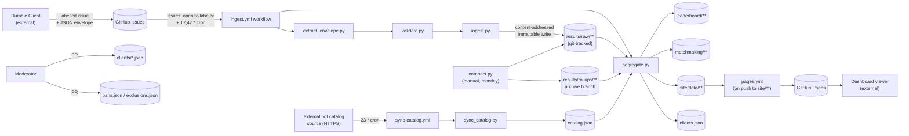

# Architecture

> Drafted from repository evidence (scripts, workflows, config files, `README.md`, `GOVERNANCE.md`) rather than a human interview; treat as `provenance: inferred` until confirmed. See `CAP-001`/`CAP-002` for capability-local design.

`rumble-data` has no application server and no database. Git is the store, GitHub Actions is the runtime, and generated JSON is the only interchange format. Everything is Python standard-library scripts plus static HTML/JS.

## Purpose and external actors

- **Battle contributor** — runs the (separate) Rumble Client, which opens a labelled GitHub issue containing a result batch. Never writes to the repository directly.
- **Bot author / dashboard viewer** — reads the published static dashboard; has no write path.
- **Moderator** — a human reviewer who merges pull requests that change `clients/*.json`, `bans.json`, `exclusions.json`, or policy/source files (`GOVERNANCE.md`).
- **CI (GitHub Actions)** — the only writer of accepted facts and generated projections on `main` (documented governance boundary, not a technically enforced one — see `C-002`).
- **External bot catalog source** — an HTTPS endpoint outside this repository that publishes the reviewed Tank Royale bot catalog; `catalog.json` is a synchronized read-only copy of it.
- **GitHub Pages** — hosts the static dashboard built from `site/`.

## Components and boundaries

- **Transport** (`scripts/extract_envelope.py`) — pulls the one required fenced JSON block out of an issue body; owns no state.
- **Validation** (`scripts/validate.py`) — pure functions checking one record against `engine.json`, `catalog.json`, `clients/*.json`, and `bans.json`; owns no state.
- **Ingestion** (`scripts/ingest.py`) — the only writer of `results/raw/`; enforces idempotency and immutability.
- **Aggregation** (`scripts/aggregate.py`) — the only writer of `leaderboard/`, `matchmaking/`, `site/data/`, and `clients.json`; fully regenerates them from tracked inputs every run.
- **Compaction** (`scripts/compact.py`) — moves aged facts into monthly rollups on a separate `archive` branch checkout, verifying aggregation is unchanged before committing the move.
- **Catalog sync** (`scripts/sync_catalog.py`) — the only writer of `catalog.json`.
- **Dashboard** (`site/`) — static HTML/CSS/JS with no build step and no server; reads only generated JSON under `site/data/`.
- **Shared kernel** (`scripts/common.py`) — canonical JSON, content addressing, and the catalog team-membership contract every other component depends on.

See `CAP-001-ranked-result-pipeline` and `CAP-002-bot-catalog-sync` for behavior inside these boundaries, and `../design/README.md` for the runtime flows connecting them.

## Durable technology choices

- **Python standard library only** — no third-party dependency for any script (`README.md`); keeps the fork drill (`G-003`) from depending on package availability.
- **Git as the database** — accepted facts and generated projections are ordinary tracked files; there is no external datastore, and history is the audit trail.
- **Content-addressed, immutable facts** — every accepted record's filename is a SHA-256 hash of its own normalized content (`common.content_hash`), which is what makes retries idempotent and edits detectable.
- **Regenerate, never patch, derived data** — `leaderboard/`, `matchmaking/`, `clients.json`, and `site/data/` are always fully rebuilt from `results/`, `catalog.json`, `clients/`, `bans.json`, and `exclusions.json`; `.github/workflows/verify.yml` fails the build if committed derived data ever drifts from what regeneration produces.
- **GitHub Issues as the submission transport, GitHub Actions as the only runtime, GitHub Pages as the only hosting** — no bespoke server or API; see `ADR-001` and `ADR-002`.
- **A parallel `archive` git branch for compacted history** — keeps `main`'s working tree from growing unbounded while keeping compacted facts in git rather than deleting them.

## Related decisions

`ADR-001` (immutable, content-addressed facts with disposable projections) and `ADR-002` (GitHub Issues as the submission transport) are the architectural decisions behind this shape; see `../decisions/README.md`.

<!-- clue:index:start -->
<!-- clue:index:end -->
