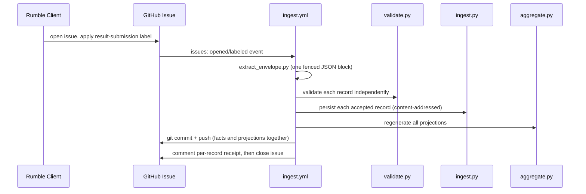

# Design

> Capability-local detail lives in `CAP-001`/`CAP-002`'s `design.md`; this page covers only what crosses capability and workflow boundaries.

## Runtime flows

### 1. Label-triggered ingestion

The commit-and-push step always happens before the receipt comment and issue close (`CAP-001`'s ordering guarantee) — a contributor is never told "accepted" before it is durably recorded.

### 2. Scheduled fallback

The same workflow also runs on a `17,47 * * * *` cron and on manual dispatch, draining every currently labelled, still-open issue rather than just the one that triggered it. This is what makes the label — not the triggering event — the actual unit of work, and it is why the workflow's `concurrency` group serializes runs instead of allowing them to race.

### 3. Catalog synchronization

A separate `23 * * * *` cron fetches the external catalog source, normalizes and validates team membership (`CAP-002`), writes `catalog.json`, and immediately regenerates every projection in the same run — so a newly eligible bot's ranking eligibility and a removed bot's disappearance from matchmaking land in one commit.

### 4. Moderation (reapply, never rewrite)

Bans, exclusions, and registration changes are ordinary pull requests to `bans.json`, `exclusions.json`, and `clients/*.json`. They take effect the next time `aggregate.py` runs — which happens on essentially every scheduled or triggered workflow — by being reapplied as a filter over the full set of currently accepted facts. No accepted fact is ever edited or deleted to enact a moderation decision; only what counts toward projections changes.

### 5. Compaction (monthly, verified before committing)

On the first drain of a month, `scripts/compact.py` moves facts older than three full months from `results/raw/` into `results/rollups/` on a separate `archive` branch checkout, running `aggregate.py` before and after the move and refusing to commit the move unless every generated projection is byte-identical. A mismatch rolls the entire move back. This is the same "regenerate and diff" pattern `verify.yml` uses in CI (see below), applied to a mutation instead of a pull request.

### 6. Verification (drift as the safety net)

`.github/workflows/verify.yml` runs the unit test suite, then regenerates every projection and fails the build (`git diff --exit-code`) if the regenerated output differs from what is committed. Because `leaderboard/`, `matchmaking/`, `clients.json`, and `site/data/` are declared disposable and always derived, this single check is what actually enforces "generated projections are always current," on every pull request and every push to `main` — including moderator PRs that only touch `bans.json` or `exclusions.json`.

### 7. Dashboard publication

`.github/workflows/pages.yml` deploys `site/` to GitHub Pages whenever a push changes anything under `site/**`; the dashboard itself makes no server calls beyond fetching the generated JSON files that ingestion and catalog sync already committed (`CAP-001`, `AC-RDA-004`).

## Cross-cutting patterns

- **Independent per-record validation** — a batch's records are never accepted or rejected as a unit; this is what lets `CAP-001` guarantee that one contributor's malformed record cannot cost their other, valid results.
- **Content addressing for idempotency** — the same pattern (SHA-256 of canonical JSON) secures both fact deduplication in `CAP-001` and dedup-safe re-ingestion after a client retry; see `common.py`.
- **Disposable, fully-regenerated derived data, guarded by drift detection** — no projection is ever partially updated; `verify.yml`'s diff check is the cross-cutting mechanism that keeps this true in practice, not just in intent.
- **CI as sole writer, humans as sole policy-changers** — every routine data change flows through a workflow; every policy or catalog-eligibility change flows through a human-reviewed pull request (`C-002`).

<!-- clue:index:start -->
<!-- clue:index:end -->
